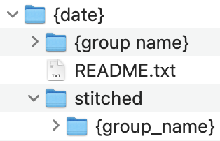
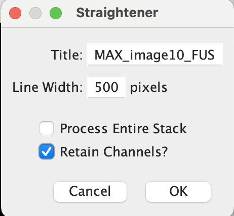
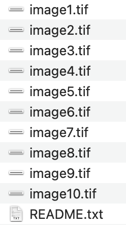

# Image Preprocessing 
Andrew Moore
edited 19 March, 2024

### Software Needed

1.  Frankenstein (github.com/moore-andrew05/FrankenStein) or other
    method of stitching images.

2.  Modified FIJI straightening plugin (link to plugin).

3.  con_auto_dir.py script to generate README (<https://github.com/moore-andrew05/worm-imtools/blob/main/wormimtools/con_auto_dir.py>).

4.  wormimtools Python package
    (<https://github.com/moore-andrew05/worm-imtools>)

### Generating README.txt

1.  Place the downloaded "con_auto_dir.py" script into the directory where you will store images.

2.  Open a terminal at this location and run \`python con_auto_dir.py\`. This script does not require external packages. The script will ask for user input and will guide you through the creation of your directory structure.

3.  The final directory structure should look like this (there can be multiple groups):  
[]()

4.  It is helpful to fill out the metadata of the README.txt file as you image, but it can also be generated after imaging.

### Cropping Protocol

1.  Stitch raw image tiles using Frankenstein or other stitching method to obtain full worm images with Z-stacks intact.

2.  Load image into FIJI and Z-project using max-intensity. You should aim to capture only the entire depth of the lumen.

3.  Using the projected image, use the "Segmented Line" tool to draw a line throughout the middle of the entire worm. Run the modified FIJI straightening plugin with a line width of 500 pixels. Ensure that the "Retain Channels?" box is checked. This will create a straightened image.

[]()

4.  This image will have its dynamic range reset to the maximum and may appear blank. Use the Brightness and Contrast window ("Image\>Adjust\>Brightness/Contrast...") to adjust the range and make each channel visible.

5.  The worm will be oriented horizontally but may not be in the correct direction. Ensure that the anterior of the worm is on the left side of the image. If it is on the right, rotate the worm 180 degrees ("Image\>Transform\>Rotate...").

6.  Using a Polygon Selection, outline the intestine of the worm from behind the pharyngeal-intestinal valve to the anal sphincter. In live images, the gut granule autofluorescence can be used to easily identify this region. Additionally, if the lumen is marked in some way, the lumen itself can be directly outlined.

7.  Clear outside of the selection ("Edit\>Clear Outside") and then crop to the selection ("Image\>Crop").

8.  Save this image. Images from a single rep of a single group must have their own unique directory containing the README file for that rep. **IMPORTANT:** The cropped image names **MUST** match the name specified in the README. If multiple groups were collected using one README, an identical copy of this README should exist in the directory for each group. A rep of 10 images should look like this:

[]()

### Using `worm-imtools`

1.  It is highly recommended that this is performed using a jupyter notebook.

2.  Using either a pip environment or a conda environment with pipinstalled, install wormimtools using `pip install wormimtools`.

#### Processing

To process a directory like the one created above, import and instantiate a `Processor` object. The channel_info should be specified as a list of tuples containing your channel names and their indexes (0-based) within the images. You can use up to 4 channels: 

``` python
from wormimtools import Processor

channel_info = [("{channel 0 name}", 0), ("{channel 1 name}", 1)]

proc = Processor("{path_to_images}", channel_info) 
```

##### Additional Args: 
``` python
Default Values:
group_number = 1  
max_value    = 65535
final_len    = 3500
```

The `Processor` class contains 3 key-word arguments which have default values.  

`group_number` is used when multiple groups are contained within a single README. This variable specifies the order of the README. If the group in the directory is second in the README, set this to `2`, etc.

`max_value` is the value that the images are normalized to. It is arbitrary, but it should be set to the max value of the image format (255 for 8bit, 65535 for 16bit, etc.). When performing downstream analysis, the dataset can be normalized to the max value of the entire dataset.

`final_len` specifies the length all arrays will be interpolated to. It should be set to a value close to the average width of the images to minimize the need for interpolation.

##### Generating a DataFrame
Using the `Processor` object, a dataframe containing processed image data and metadata from the README can be generated and accessed as follows:

``` python
proc.generate_db()                  # Generate DataFrame
data = proc.df                      # Access DataFrame 
```

The `Processor` object also contains an `update_db` function which is used as follows: 

``` python
proc.update_db(path)
```
`path` is the absolute path to a current DataFrame saved as a pkl file. **WARNING**: This function will only perform as expected if the two DataFrames share identical columns. If you add your own metadata to your data, please merge and update your DataFrames yourself. 

##### Utilities 
The package provides two utility functions to help with downstream analysis of unnormalized and uninterpolated data, stored in the data as `channel{i}_arr_vals_raw`. They can be imported as follows: 

``` python
from wormimtools.utils import interp1d, normalize
```
`interp1d` takes an array and a desired length as arguments and returns that array interpolated to the desired length. This is useful for analysis that requires all vectors be the same length. 
`normalize` simply normalizes the input array to a desired value. This can be useful for images that do not cover the full dynamic range of the sensor to increase contrast, especially when displaying images or barcode plots. 

##### DataFrame Structure
The generated DataFrame contains the following metadata columns specified in README.txt:

``` python
date                            # Date the rep was collected              
strain                          # C. elegans strain used
diet                            # Name of the bacterial diet
temp                            # Temperature worms developed at
rep                             # Rep number
name                            # Relative file name
stage                           # C. elegans developmental stage 
rating                          # Rating of quality of worm
comments                        # Comments given at imaging
ID                              # UUID
```
It also contains the following data columns for channel i (i = 0,1,2,3):

``` python 
channel{i}_name                 # Channel i name specified in `channel_info`
channel{i}_arr_vals             # Normalized and interpolated array values
channel{i}_arr_vals_ni          # Normalized array values
channel{i}_arr_vals_raw         # Raw array values
```
In most cases, the raw array values should be used for downstream analysis. 


#### Barcode Plotting

1.  To create barcode plots of the processed arrays, import and instantiate a `BarcodePlotter` object: 

``` python
from wormimtools import BarcodePlotter

plotter = BarcodePlotter()
```

##### Single Channel Plotting
``` python
data = [["Single Channel"]]    # List of arrays generated by Processor

plotter.plot_barcodes_single(data, save={"save_path"})
```
The `save` argument is optional, defaulting to None.

##### Dual Channel Plotting
``` python
data = [[["Channel 0"], ["Channel 1"]]] # List of lists of len=2 with arrays for 2 channels of an image

plotter.plot_barcodes_dual(data)
```
The `save` argument is the same as single channel plotting. 